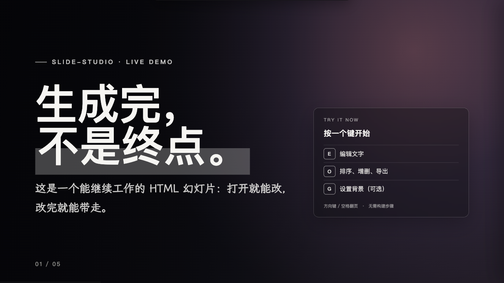

# slide-studio

A coding-agent skill for making **editable** HTML slide decks — generate a deck from an idea, some notes, or a PowerPoint file, then edit the text, change the type, reorder slides, and add backgrounds right in the browser.

**English** ·  [中文](README.zh-CN.md)

<p>
  <a href="https://ying-a1.github.io/slide-studio/">Try the live demo</a> ·
  <a href="https://github.com/Ying-A1/slide-studio/releases">Releases</a>
</p>



Open the demo and press **E** to edit text, **O** to reorder or duplicate slides, and **G** to try the optional image panel. The demo uses CSS gradients only, so it does not need an API key.

## What this does

slide-studio produces a single self-contained `.html` file — fixed 16:9, zero dependencies. Unlike a one-shot generator, the file opens with a built-in editor: you keep working on the finished deck — retype text, change font size and spacing, reorder slides, swap backgrounds — without touching code or opening another app.

## Key features

- **In-browser text editing** — press `E`, click any text, type.
- **Type controls** — select text and a format bar sets font size, hierarchy level (display / title / body / caption), line-height, weight, and alignment.
- **Slide organizer** — press `O` to drag-reorder (or ↑ ↓), insert, duplicate, delete, and jump between slides, then export a clean standalone HTML with every change baked in.
- **Optional AI backgrounds** — press `G` to generate cinematic backgrounds with your own OpenAI-compatible image API. Completely optional; CSS gradients work with no key, and no key ships with this repo.
- **Visual style discovery** — choose a look from generated title-slide previews, backed by curated presets and a 34-template bold pack, instead of describing your taste in words.
- **PowerPoint extraction** — extract `.pptx` text, images, order, and speaker notes as a structured starting point for a web deck.
- **PDF & live-URL export** — export a PDF, or deploy a shareable Vercel link that works on phones.
- **Zero dependencies** — one HTML file, inline CSS/JS, works offline, stays 16:9 on every screen.
- **Distinctive by default** — a built-in design doctrine that avoids generic "AI-slop" layouts.

## Install

Clone the skill into your Claude Code skills folder:

```bash
git clone https://github.com/Ying-A1/slide-studio.git ~/.claude/skills/slide-studio
```

Or copy an existing checkout:

```bash
cp -R slide-studio ~/.claude/skills/slide-studio
```

## Use

```text
# generate — just ask:
Use slide-studio to make a deck about "…"

# refine — open the generated .html and:
E  edit text        O  reorder / add / delete slides
G  AI backgrounds   ← → / Space  navigate        ?s=5  open on slide 5

# finish — "Export HTML" in the organizer, or run the PDF / Vercel scripts
```

## Keyboard

| Key | Action |
|---|---|
| `←` `→` / Space / scroll | Navigate |
| `E` | Edit text (then the format bar sets size / level / line-height) |
| `O` | Organizer: reorder · add · duplicate · delete · Export HTML |
| `G` | Image / API settings (optional) |
| `?s=5` | Open on slide 5 |

## Why the decks look good

A built-in set of rules (see [`references/design-rules.md`](references/design-rules.md)): lock a design system first; keep text as a layer over images, never baked in; reuse one "style paragraph" so every image matches; compose around the empty space; test the first image before generating the rest.

## Optional tooling

The generated HTML itself has no runtime dependencies and works offline. Some optional workflows need extra tools:

- PPTX extraction: Python and `python-pptx`.
- PDF export: Node.js, `npx`, and Playwright/Chromium.
- Vercel deployment: the Vercel CLI and a Vercel login.
- Web fonts: the template loads Google Fonts and jsDelivr when online, then falls back to local system fonts.

## Credits & license

Builds on **frontend-slides** (MIT © 2025 Zara Zhang) — its template pack and export scripts are included here, with attribution in [NOTICE.md](NOTICE.md). The design rules are distilled from *"How to Vibe Code AI Slides"* by *Isa does AI*.

[MIT](LICENSE) © 2026 Ying-A1
